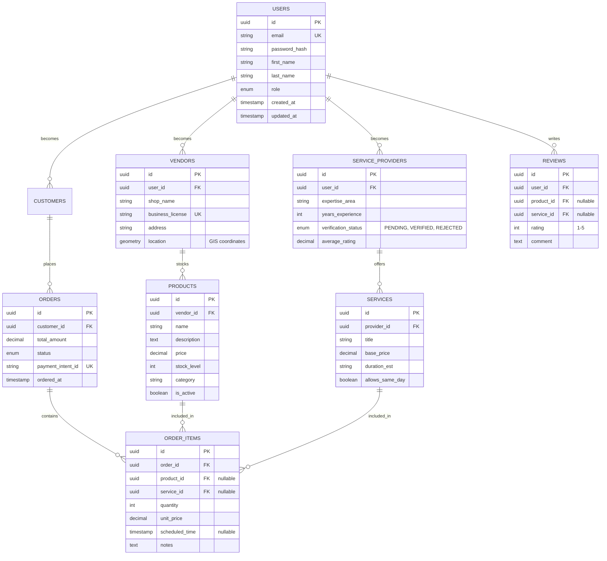

# ER Diagram (Entity-Relationship)

This diagram details the relational database schema for the **LocalLink** platform (PostgreSQL).

## Constraints & Data Policies

1.  **Referential Integrity**: All deletions are handled via `ON DELETE CASCADE` or `SET NULL` depending on the entity (e.g., deleting a product preserves the order item but nullifies the reference).
2.  **GIS Capabilities**: The `location` field in `VENDORS` uses **PostGIS** to enable efficient "Find shops within X km" queries.
3.  **Auditing**: Every table includes `created_at` and `updated_at` timestamps for tracking and debugging.
4.  **Soft Deletes**: Active flags (`is_active`) are used for products and services to preserve historical order data.
5.  **Unique Constraints**: `email` and `business_license` are indexed and unique to prevent duplicate registrations.

## Tech Stack (Database Context)

- **Primary Database:** PostgreSQL 15+ (Relational with JSONB support).
- **Extensions:** PostGIS for location-based search.
- **ORM:** Prisma (for **TypeScript** type safety across the database layer).
- **Migration Strategy:** Version-controlled migrations using Prisma Migrate.
- **Indexing Strategy:** 
    - B-Tree index on `email`, `ordered_at`, and `category`.
    - GIST index on `location` for spatial queries.

