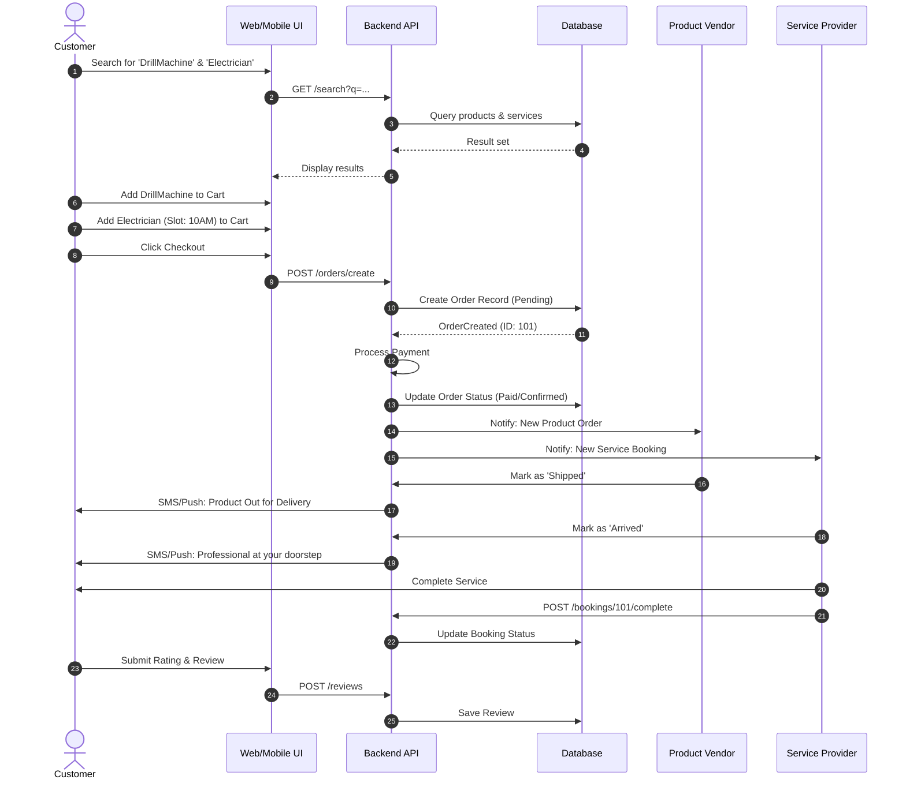
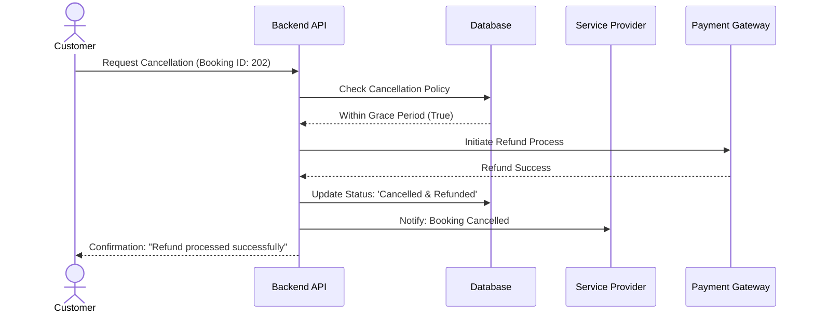

# Sequence Diagram: Unified Checkout Flow

This diagram tracks the end-to-end process of a customer purchasing a product and booking a service simultaneously.

## Key Interaction Steps

1.  **Discovery**: Unified search results return both product and service entities from the database.
2.  **Transaction**: The API creates a single order record with multiple line items, ensuring atomicity.
3.  **Real-Time Notifications**: The system triggers parallel notifications to both the Product Vendor and the Service Provider upon successful payment.
4.  **Completion**: The Service Provider confirms completion via their portal, triggering the review flow for the customer.

## Alternative Flow: Booking Cancellation

This flow illustrates what happens when a customer cancels a service booking before it starts.

