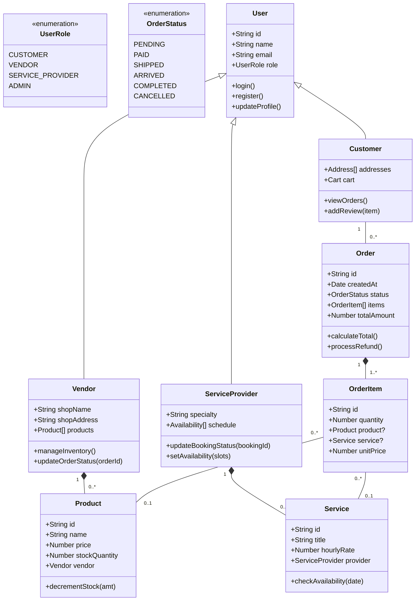

# Class Diagram

The following diagram represents the core TypeScript classes/entities and their relationships in the LocalLink application.

## TypeScript Implementation Details

- **Type Safety**: The system utilizes TypeScript's `Discriminated Unions` for handling different types of `OrderItem` (Product vs. Service).
- **Architecture**: Follows the **SOLID Principles**, particularly the *Interface Segregation Principle*, by splitting `Vendor` and `ServiceProvider` specific logic while inheriting shared `User` properties.
- **Methods**: All business logic (like `calculateTotal` and `decrementStock`) is encapsulated within the domain entities to maintain high cohesion.
- **Enumerations**: Explicit enums for `UserRole` and `OrderStatus` ensure that the application state remains predictable and type-safe across the stack.
